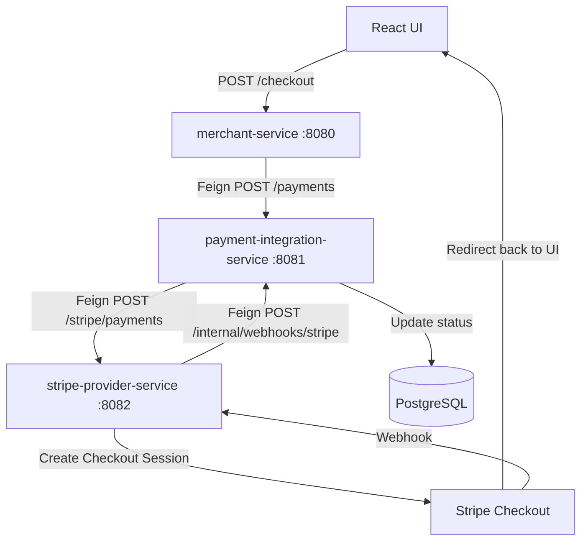

# Payment Demo (Merchant → Integration → Stripe)

A beginner-friendly demo showing a common “payments orchestration” architecture:

- `merchant-service` starts a payment (your app / checkout entrypoint)
- `payment-integration-service` creates a `paymentId`, persists the payment, routes to a provider (Stripe)
- `stripe-provider-service` talks to Stripe (Checkout) and receives Stripe webhooks
- Stripe confirms payment asynchronously via webhook → DB is updated to `SUCCESS` / `FAILED`

This repo also includes a small React UI (`payments-demo`) to test the flow in a browser.

## High-Level Flow



### Why webhook?
Stripe (and most providers) confirm the final result asynchronously. The UI redirect is not the source of truth; the webhook is.

## Services & Ports

- `merchant-service` → `http://localhost:8080`
- `payment-integration-service` → `http://localhost:8081`
- `stripe-provider-service` → `http://localhost:8082`
- React UI (`payments-demo`) → `http://localhost:5173`

## Prerequisites

- Java 17
- Node.js 18+ (recommended)
- PostgreSQL 16+ (local) **or** Docker
- Stripe account (test mode) + Stripe CLI

## Configuration (Environment Variables)

These are used by multiple services:

- `INTERNAL_API_KEY` (shared secret for internal calls; default: `dev-internal-key`)
- `STRIPE_SECRET_KEY` (Stripe API key; `sk_test_...`)
- `STRIPE_WEBHOOK_SECRET` (Stripe webhook signing secret; `whsec_...`)

## Quick Start (Local)

### 1) Start PostgreSQL

Option A: local PostgreSQL
- Create DB user matching `payment-integration-service/src/main/resources/application.yaml`

Option B: Docker
```bash
docker run --name payment-postgres -e POSTGRES_USER=postgres -e POSTGRES_PASSWORD=postgres -e POSTGRES_DB=payment_db -p 5432:5432 -d postgres:16
```

### 2) Start Stripe webhook forwarding

In a terminal:
```bash
stripe listen --forward-to http://localhost:8082/webhooks/stripe
```

Copy the shown `whsec_...` and export it:
```bash
export STRIPE_WEBHOOK_SECRET=whsec_...
```

### 3) Start the backend services

Use the same `INTERNAL_API_KEY` in both `payment-integration-service` and `stripe-provider-service`:
```bash
export INTERNAL_API_KEY=dev-internal-key
export STRIPE_SECRET_KEY=sk_test_...
export STRIPE_WEBHOOK_SECRET=whsec_...
```

Then run each service (3 terminals):
```bash
cd payment-integration-service && ./mvnw spring-boot:run
cd stripe-provider-service && ./mvnw spring-boot:run
cd merchant-service && ./mvnw spring-boot:run
```

## Deploy (Docker Compose)

### 1) Create env file

```bash
cp deploy.env.example .env
```

Fill `STRIPE_SECRET_KEY` and `STRIPE_WEBHOOK_SECRET` in `.env`.

### 2) Start everything

```bash
docker compose up --build
```

### 3) Stripe webhook (local)

In another terminal (host machine):
```bash
stripe listen --forward-to http://localhost:8082/webhooks/stripe
```

Services:
- Merchant: `http://localhost:8080`
- Integration: `http://localhost:8081`
- Stripe Provider: `http://localhost:8082`
- PostgreSQL: `localhost:5432`

To stop:
```bash
docker compose down
```

### 4) Start the React UI

```bash
cd payments-demo
cp .env.example .env
npm install
npm run dev
```

Open `http://localhost:5173`, click “Pay with Stripe”, and complete the Stripe test checkout.

Test card:
- `4242 4242 4242 4242`
- Any future expiry, any CVC

## What Gets Stored in DB?

### `payments`
Stores the business payment record:
- `paymentId` (UUID used across services)
- `orderId`
- `status` (`CREATED` → `PENDING` → `SUCCESS/FAILED`)
- provider audit references (`providerSessionId`, `providerPaymentIntentId`)

### `payment_webhook_events`
Stores processed webhook event IDs (idempotency):
- unique (`provider`, `providerEventId`)
- prevents double-processing when Stripe retries/delivers duplicates

## API Endpoints (Most Useful)

### Merchant Service
- `POST /checkout` → starts a payment and returns `{ paymentId, redirectUrl }`

### Payment Integration Service
- `POST /payments` → creates payment and returns `{ paymentId, redirectUrl, status }`
- `GET /payments/{paymentId}` → fetch current status/details
- `GET /payments/recent` → last 20 payments (debug)

### Stripe Provider Service
- `POST /stripe/payments` → creates Stripe Checkout Session
- `POST /webhooks/stripe` → Stripe webhook receiver (signature verified)

## Troubleshooting

### CORS error in browser
Make sure services are restarted after code changes. CORS is configured to allow:
- `http://localhost:5173`
- `http://localhost:3000`

### Status stuck on `PENDING`
- Confirm `stripe listen --forward-to ...` is running
- Confirm `STRIPE_WEBHOOK_SECRET` matches `whsec_...` from `stripe listen`
- Check `stripe-provider-service` logs: it should call `payment-integration-service` internal webhook endpoint

### 401 on internal calls
Internal endpoints require `X-Internal-Api-Key`. Ensure:
- `INTERNAL_API_KEY` is set to the same value in both services
